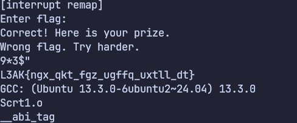
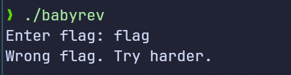
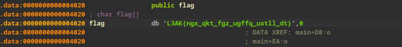

## Baby Rev
*Reverse Engineering*

Got something interesting by running *strings* command.



So Typical Crackme
*Strace* and *ltrace* returns nothing.

Decompiled code cleanded up
```C
int __fastcall main(int argc, const char **argv, const char **envp)
{
  v3 = time(0LL);
  v4 = v3;
  srand(v3);
  init_remap(v4, argv);
  printf("Enter flag: ");
  fgets(input, 64, stdin);
  for ( i = 0; input[i]; ++i )
  {
    v7 = input[i];
    if ( v7 >= 0 )
      input[i] = remap[(unsigned __int8)v7];
  }
  v5 = strlen(flag);
  if ( !strncmp(input, flag, v5) )
    puts("Correct! Here is your prize.");
  else
    puts("Wrong flag. Try harder.");
  return 0;
}
```


Flag contains the thing that i got from strings command earlier. But that is not the correct flag. The formatting is correct but the flag inside is not.


```c
__int64 init_remap()
{
  __int64 result; // rax
  int i; // [rsp+0h] [rbp-4h]

  for ( i = 0; i <= 127; ++i )
  {
    result = i;
    remap[i] = i;
  }
  qmemcpy(&byte_4121, "qwertyuiopasdfghjklzxcvbnm", 26);
  return result;
}
```

What init_remap() did.

remap is an array. 
remap[0] = 0
remap[1] = 1
.....
remap[127] = 127

then it copies "qwertyuiopasdfghjklzxcvbnm" which is size 26 to *byte_4142* location. And i
then the function returns 127.

```bash
.bss:00000000000040C0 ; _BYTE remap[97]
.bss:00000000000040C0 remap           db 61h dup(?)           ; DATA XREF: init_remap+1B↑o
.bss:00000000000040C0                                         ; sigint_handler+6D↑o ...
.bss:0000000000004121 byte_4121       db ?                    ; DATA XREF: init_remap+2F↑w
.bss:0000000000004122 byte_4122       db ?                    ; DATA XREF: init_remap+36↑w
.bss:0000000000004123 byte_4123       db ?                    ; DATA XREF: init_remap+3D↑w
.bss:0000000000004124 byte_4124       db ?                    ; DATA XREF: init_remap+44↑w
.bss:0000000000004125 byte_4125       db ?                    ; DATA XREF: init_remap+4B↑w
.bss:0000000000004126 byte_4126       db ?                    ; DATA XREF: init_remap+52↑w
.bss:0000000000004127 byte_4127       db ?                    ; DATA XREF: init_remap+59↑w
.bss:0000000000004128 byte_4128       db ?                    ; DATA XREF: init_remap+60↑w
.bss:0000000000004129 byte_4129       db ?                    ; DATA XREF: init_remap+67↑w
.bss:000000000000412A byte_412A       db ?                    ; DATA XREF: init_remap+6E↑w
.bss:000000000000412B byte_412B       db ?                    ; DATA XREF: init_remap+75↑w
.bss:000000000000412C byte_412C       db ?                    ; DATA XREF: init_remap+7C↑w
.bss:000000000000412D byte_412D       db ?                    ; DATA XREF: init_remap+83↑w
.bss:000000000000412E byte_412E       db ?                    ; DATA XREF: init_remap+8A↑w
.bss:000000000000412F byte_412F       db ?                    ; DATA XREF: init_remap+91↑w
.bss:0000000000004130 byte_4130       db ?                    ; DATA XREF: init_remap+98↑w
.bss:0000000000004131 byte_4131       db ?                    ; DATA XREF: init_remap+9F↑w
.bss:0000000000004132 byte_4132       db ?                    ; DATA XREF: init_remap+A6↑w
.bss:0000000000004133 byte_4133       db ?                    ; DATA XREF: init_remap+AD↑w
.bss:0000000000004134 byte_4134       db ?                    ; DATA XREF: init_remap+B4↑w
.bss:0000000000004135 byte_4135       db ?                    ; DATA XREF: init_remap+BB↑w
.bss:0000000000004136 byte_4136       db ?                    ; DATA XREF: init_remap+C2↑w
.bss:0000000000004137 byte_4137       db ?                    ; DATA XREF: init_remap+C9↑w
.bss:0000000000004138 byte_4138       db ?                    ; DATA XREF: init_remap+D0↑w
.bss:0000000000004139 byte_4139       db ?                    ; DATA XREF: init_remap+D7↑w
.bss:000000000000413A byte_413A       db ?                    ; DATA XREF: init_remap+DE↑w
.bss:000000000000413B                 align 20h

```

size of remap = 97.
It starts at 0x40C0

byte_4121 starts at 0x4121


so basically remap[97] = byte_4142

```c
for (int i = 0; i <= 127; ++i)
    remap[i] = i;

memcpy(&remap['a'], "qwertyuiopasdfghjklzxcvbnm", 26);

```

So it fills up till remap. then
remap[a] = q
remap[b] = w
......
remap[z] = m


```c
 for ( i = 0; input[i]; ++i )
  {
    v7 = input[i];
    if ( v7 >= 0 )
      input[i] = remap[(unsigned __int8)v7];
  }
  v5 = strlen(flag);
  if ( !strncmp(input, flag, v5) )
    puts("Correct! Here is your prize.");
  else
    puts("Wrong flag. Try harder.");
  return 0;
```
input array is my input.

this function *transforms* my input. Then it checks the input with flag array.
say input = "L3AK{ngx_qkt_fgz_ugffq_uxtll_dt}"

it only happens for lowercase letters. cause there is no change for Highercase letter in remap array.

	


